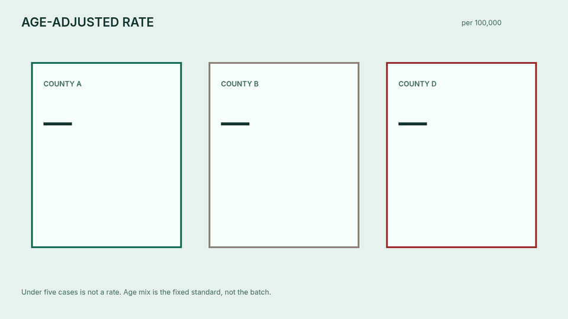

# County Health Normalize

Age-adjusted county rates with small-cell suppression.

[](https://www.python.org)
[](LICENSE)

## The problem this solves

A county with three cases can look like an outbreak next to a county with the same crude rate and a hundred times the population. Age mix does the same trick: a retiree-heavy county shows a higher crude rate for a disease of older adults even when each age group matches its peers.

County Health Normalize publishes a rate per 100,000 only after two steps. It directly standardizes each county to a fixed age mix (0–17 at 0.22, 18–64 at 0.62, 65+ at 0.16), and it withholds any county with fewer than five cases. Among the rates that are published, a county at least twice the median adjusted rate is flagged. Cases above population, a zero population band, or a missing age group raise.

The figures are computed from the counts the caller supplies. This repository does not contain a health-department extract. The small-cell rule is aligned with the usual practice of not printing counts of one to four. It is not a certification.

## Watch the demo

<p align="center">
  
</p>

Play the video: [docs/watch.html](docs/watch.html)

## Quick start

```bash
python3 -m venv venv
source venv/bin/activate
pip install -e ".[dev]"
python -m county_health_normalize
python -m county_health_normalize.harness
python -m unittest discover -s tests -v
```

```python
import asyncio
from county_health_normalize import CountyHealthNormalizer

report = asyncio.run(
    CountyHealthNormalizer().run(
        [
            {
                "county": "A",
                "bands": [
                    {"age": "0-17", "pop": 10000, "cases": 2},
                    {"age": "18-64", "pop": 40000, "cases": 20},
                    {"age": "65+", "pop": 8000, "cases": 40},
                ],
            }
        ]
    )
)
```

## Bounds

| Rule | Behavior |
| --- | --- |
| Fewer than 5 cases | County suppressed, rate not published |
| Cases above population, negative counts, or a zero population band | Raises |
| Age groups other than 0–17, 18–64, and 65+ | Raises |
| Published adjusted rate at least twice the median | Flagged |
